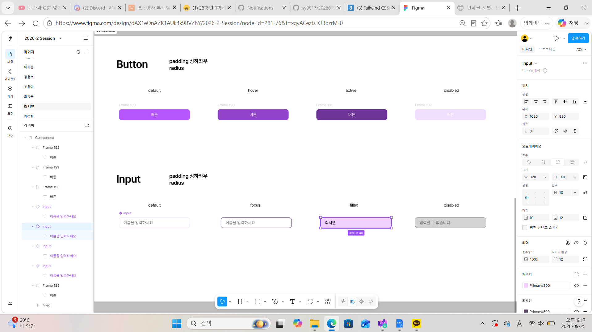
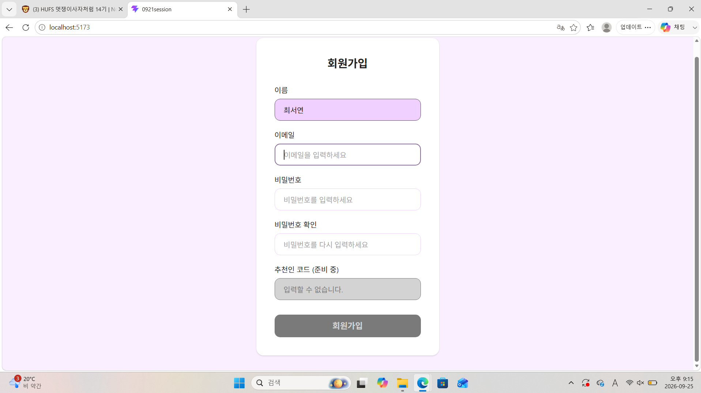

# 2026.9.21 과제

회원가입 페이지 및 재사용 가능한 Input 컴포넌트 구현 과제입니다.

## Figma 디자인

Button / Input 컴포넌트를 상태(default / focus / filled / disabled)에 따라 구현했습니다.



## 구현 결과 (회원가입 페이지)

이름 / 이메일 / 비밀번호 / 비밀번호 확인 입력창과 회원가입 버튼을 구현했습니다.



## 실행 방법

```bash
npm install
npm run dev
```
